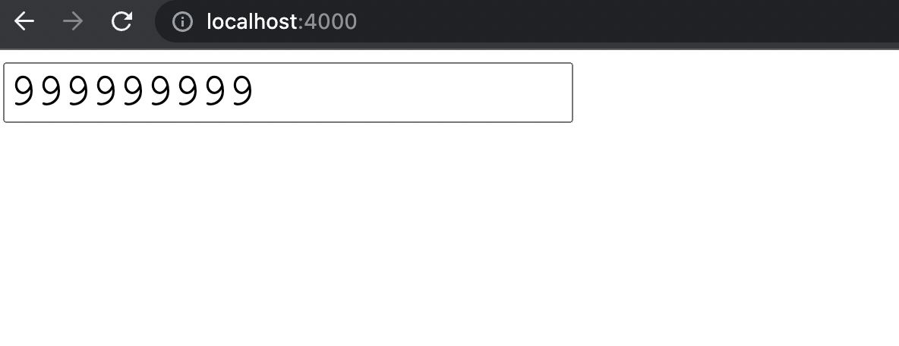
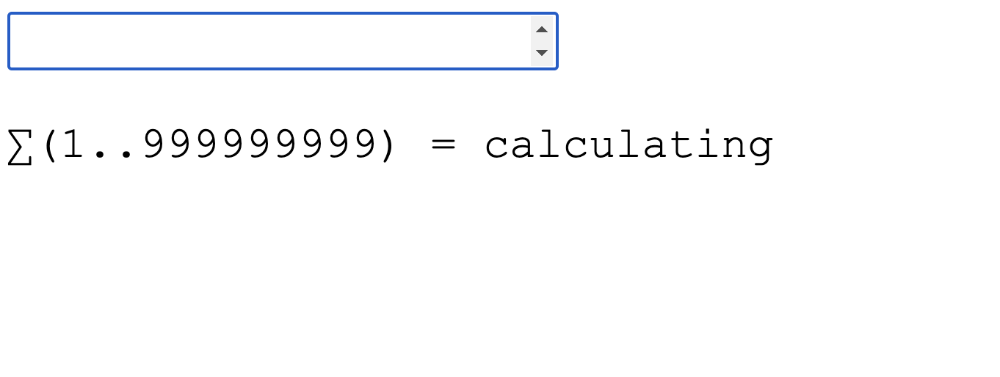
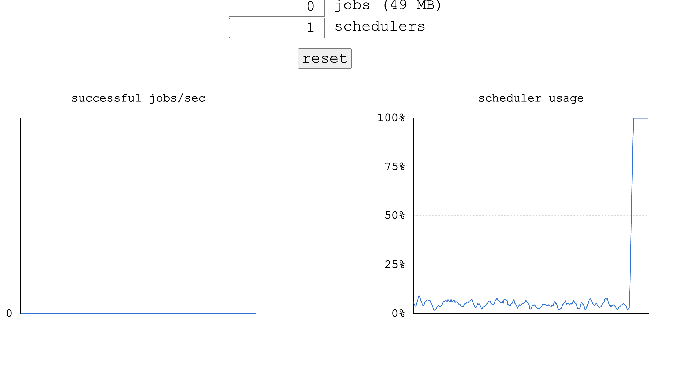
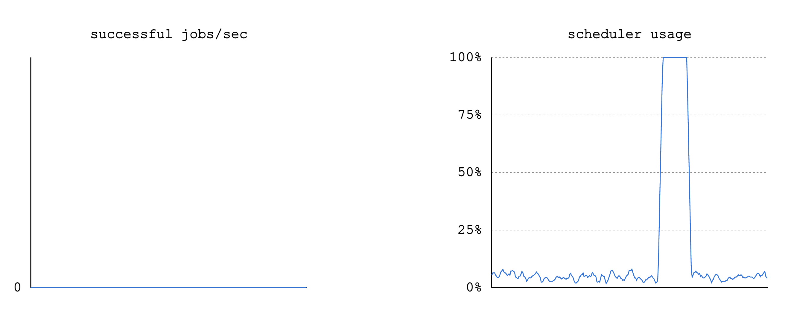
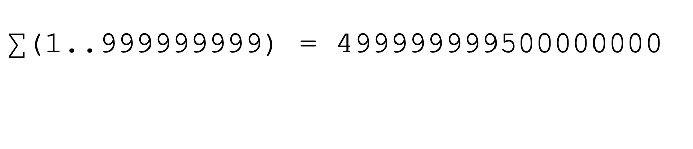
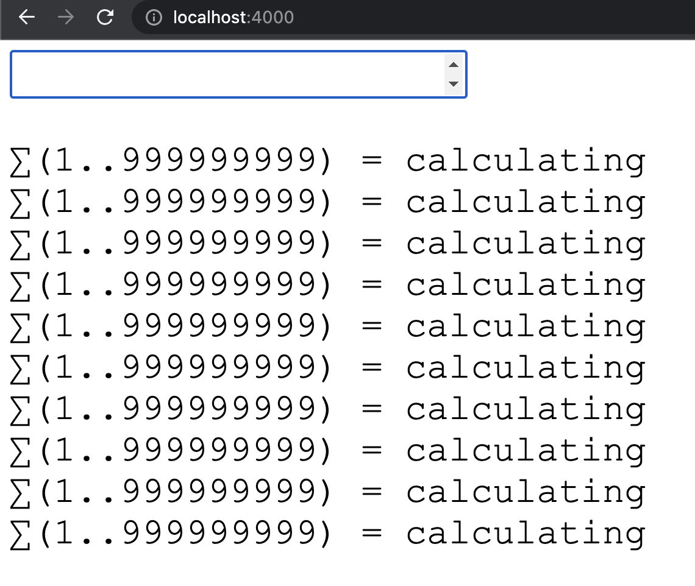
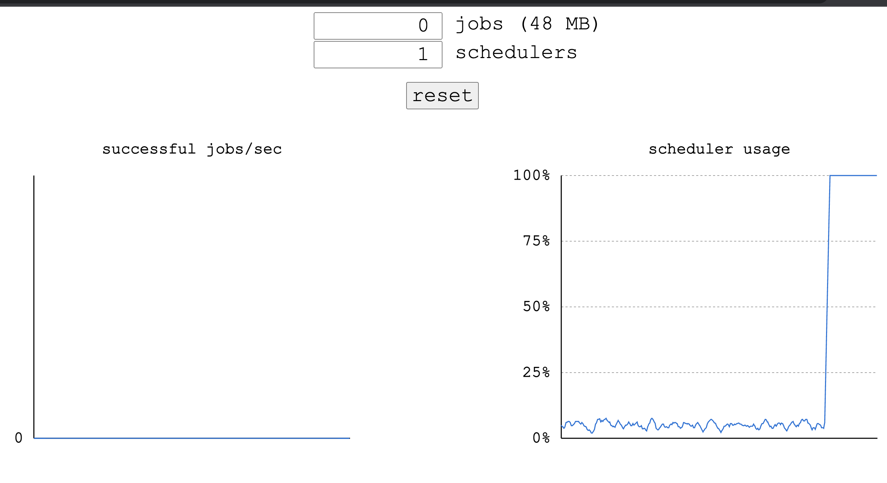
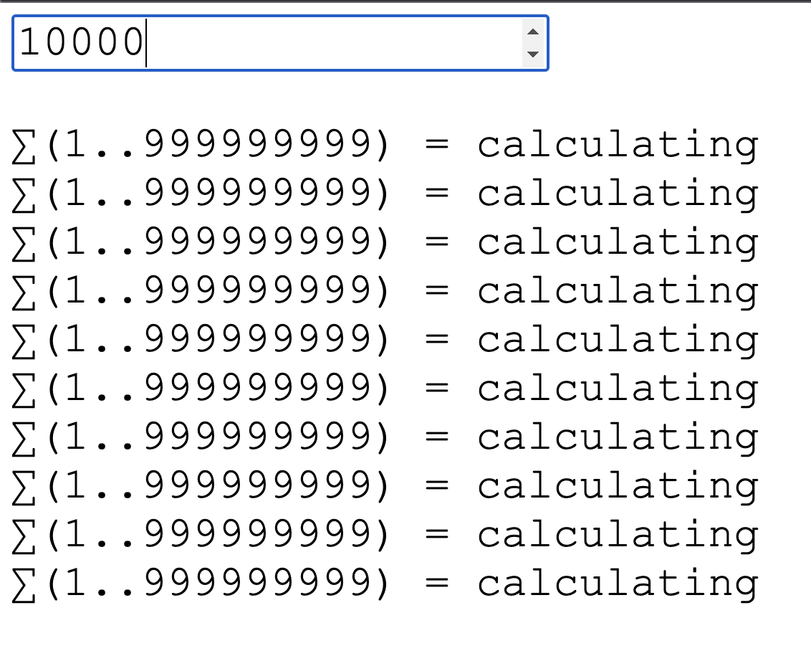

```yaml
The Soul of Erlang and Elixir • Saša Jurić 를 보고 든 생각 & 내용 정리
```
# The Soul of Erlang and Elixir
[링크](https://www.youtube.com/watch?v=JvBT4XBdoUE&ab_channel=GOTOConferences)의 영상을 보고, 우리가 흔히 쓰는 API 서버들이 돌아가는 방식이 괜찮은가라는 의문이 들기 시작했다.  

Python + Django + Gunicorn으로 영상과 같은 팩토리얼 계산 API서버를 작성했다 생각하고 글을 작성한다.

컴퓨팅에 사용되는 코어는 1개라고 가정한다.  
(Gunicorn 기준 워커가 2개 떠있다라고 생각하면 된다.)

## 999999999!를 1회 계산하다
해당 예제를 가지고 로컬에서 테스트해보겠다.  
시연되었던 버전은 너무 오래되서, docker파일로 실행시킬 수 있게 만들어놨고, 해당 소스는 https://github.com/paca94/demo_system 에서 받을 수 있다.


위의 이미지에서 해당 값을 넣고 엔터를 누른다면, API 서버로 999999999! 계산을 요청하게 된다.  
서버는 요청을 받고 결과를 계산하기 시작한다.

<br/>
<br/>



해당 값을 서버에 요청했고, 계산중이므로 calculating이라고 표시가 된다.  
그리고 두번째 이미지는 현재 리소스 사용 상황을 보여주고 있는 dashboard다.  
여기서 scheduler가 Gunicorn으로 치면 worker 1대 라고 봐도 된다. ( 1코어 서버 1대라고 봐도 무방하다 )

<br/>
<br/>



dashboard 상에서 리소스 사용이 줄어들었고, 요청 페이지를 확인해보니, 결과값이 정상적으로 출력된다.

이러한 결과는 어떤 언어 & 프레임워크를 쓰는 것과 관계없이 볼 수 있는 결과물이다.


## 999999999!를 10회 계산하다
이번에는 99999999!를 10회 연속으로 요청하려 한다.  
이 글을 읽는 분께선 스스로 해당 서버를 작성했다 생각하고 머리로 시뮬레이션을 돌려보고 이 글을 보시면 더 재밌게 볼 수 있을거라 감히 예상한다.

이제 99999999!를 10번 요청해보겠다.




요청을 10번을 하고 대시보드를 확인해보면, 역시나 사용률이 100%를 찍고 있다.

<br/>
<br/>



만약, 해당 값들이 모두 계산되고 있는데, 10000!을 계산 요청을 한다면, 어떻게 될 것 같은가?


<iframe width="560" height="315" src="https://www.youtube.com/embed/tXiUKPAMEsA" title="YouTube video player" frameborder="0" allow="accelerometer; autoplay; clipboard-write; encrypted-media; gyroscope; picture-in-picture" allowfullscreen></iframe>

이미 10개의 999999999! 가 계산되고 있는데도, 10000!의 반환은 바로 이루어진다!

python으로 해당 서버를 짠다고 하면, 이게 가능할까? 싶은 결과물이다.

아래는 해당 요청에 대해 풀로 찍어놓은 영상이다.

<iframe width="560" height="315" src="https://www.youtube.com/embed/aL7tHYbT3xY" title="YouTube video player" frameborder="0" allow="accelerometer; autoplay; clipboard-write; encrypted-media; gyroscope; picture-in-picture" allowfullscreen></iframe>


## 이게 어떻게 가능할까

아래 링크의 영상을 보면 된다

<iframe width="560" height="315" src="https://www.youtube.com/embed/JvBT4XBdoUE?start=379" title="YouTube video player" frameborder="0" allow="accelerometer; autoplay; clipboard-write; encrypted-media; gyroscope; picture-in-picture" allowfullscreen></iframe>

BEAM(VM)은 선점형 스케쥴러를 사용하고 있고, 일정 횟수 이상 도는 process에 대해서는 해당 시점에 처리를 보류하고, 다른 프로세스부터 먼저 처리한다.

그렇기 때문에, BEAM 기반의 Erlang/Elixir와 같은 언어로 작성된 서버는 서버가 아무리 바쁘거나, 문제가 생기더라도 어느정도의 응답성을 보장해준다.

## 내가 사이드로라도 써봤던 언어들과 비교
